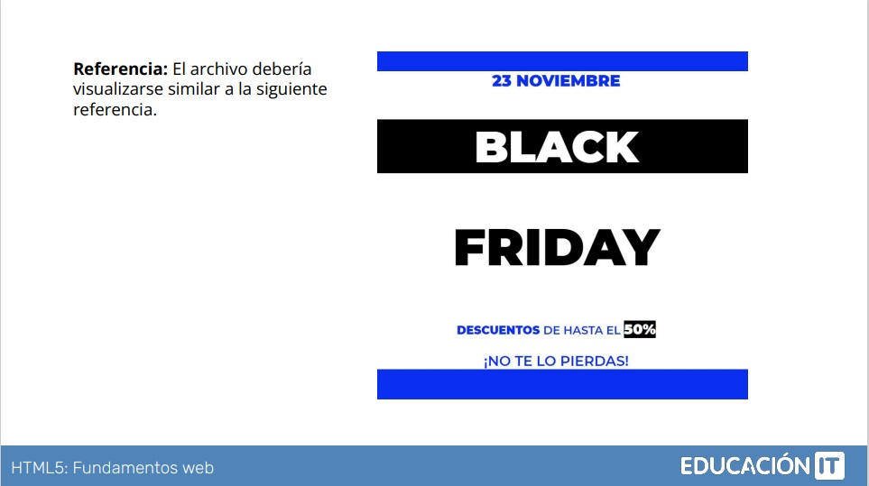

# Fundamentos Web - Laboratorio 3 
***
## Ejercicio de práctica, laboratorio de fundamentos de HTML y CSS del curso en Educación IT 

En este laboratorio practico lo aprendido.   
Recibí el requerimiento y lo realicé en HTML y CSS. 

#### Mi Resultado: 
Para identificar el color azúl, al no tener el requerimiento especificado, utilicé como herramienta a la aplicación color picker "Color Cop" http://colorcop.net

#### Requerimiento y Consigna:

 

<ol> 
  <li>Crear un archivo llamado index.html, colocar el texto "Laboratorio 3" en la etiqueta TITLE y visualizar el mismo en la pestaña del navegador. Los textos se 
trabajan dentro de un div.</li>
  <li>Para trabajar, copiar el texto que figura en el requerimiento.</li>
  <li>Utilizar los siguientes elementos: enunciados, strong, span y párrafos.</li>
  <li>Utilizar las siguientes propiedades: font-family, font-size, color, background-color.</li>
  <li>Trabajar con Google Fonts para poder implementar las tipografías que se muestran en el requerimiento. Para poder convertir pt a px recomendamos 
  utilizar la siguiente página: https://pixelsconverter.com/pt-to-px.</li>
  <li>Utilizar las tipografías y sus variantes correctamente desde Google Fonts.</li>
</ol>

## A medida que aprendo más en profundidad, mi idea es continuar trabajando en nuevos laboratorios, e ir optimizando los ya existentes. 
